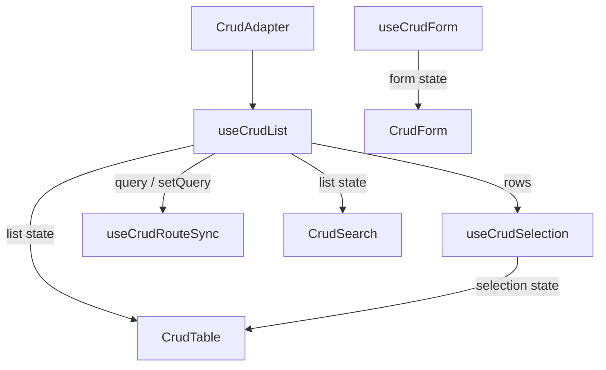

# Hooks 组合模式

`AutoCrud` 是开箱即用的一体化组件，适合大多数场景。但当你需要**完全控制布局、交互流程或混合自定义 UI**时，可以直接使用底层 hooks 和子组件进行自由组合。

## 何时选择组合模式

| 需求 | AutoCrud | Hooks 组合 |
|---|---|---|
| 标准 CRUD 页面 | 推荐 | 可以但没必要 |
| 自定义页面布局（左右分栏、tabs 等） | 受限 | 推荐 |
| 需要在多个组件间共享列表状态 | 需 ref/expose | 推荐 |
| 完全自定义搜索/表格/表单交互 | slot 能力受限 | 推荐 |

## 数据流



核心原则：**hooks 管理状态，组件负责渲染**。每个 hook 的返回值直接传给对应组件的 props。

## 完整示例

```vue
<script setup lang="ts">
import { useCrudForm, useCrudList, useCrudSelection } from '@uozi/vito-core'
import { CrudForm, CrudSearch, CrudTable } from '@uozi/vito-naive-ui'
import { ref } from 'vue'
import { adapter, columns, fields } from './schema'

// 1. 列表
const list = useCrudList({
  adapter,
  initialQuery: {},
  initialPageSize: 20,
})

// 2. 行选择
const selection = useCrudSelection({
  rows: list.rows,
  getId: row => row.id,
})

// 3. 表单
const form = useCrudForm({ fields })
const formVisible = ref(false)

function openCreate() {
  form.reset()
  form.setMode('create')
  formVisible.value = true
}

function openEdit(row: any) {
  form.reset(row)
  form.setMode('edit')
  formVisible.value = true
}

async function handleSubmit(data: any) {
  if (form.mode.value === 'create') {
    await adapter.create!(data)
  } else {
    const id = (form.model as any).id
    await adapter.update!(id, data)
  }
  formVisible.value = false
  await list.refresh()
}
</script>

<template>
  <div>
    <!-- 搜索区 -->
    <CrudSearch :list="list" :fields="fields" />

    <!-- 工具栏 -->
    <div style="margin-bottom: 16px">
      <NButton type="primary" @click="openCreate">新增</NButton>
      <span v-if="selection.selectedCount.value > 0" style="margin-left: 12px">
        已选 {{ selection.selectedCount.value }} 项
        <NButton size="small" @click="selection.clear()">清除</NButton>
      </span>
    </div>

    <!-- 表格 -->
    <CrudTable
      :list="list"
      :columns="columns"
      :selection="selection"
      :row-key="(row) => row.id"
      show-actions-column
    >
      <template #row-actions="{ row }">
        <NButton size="small" @click="openEdit(row)">编辑</NButton>
      </template>
    </CrudTable>

    <!-- 表单 -->
    <CrudForm
      v-model:visible="formVisible"
      :form="form"
      :fields="fields"
      display-mode="drawer"
      @submit="handleSubmit"
    />
  </div>
</template>
```

## 各 Hook 职责

| Hook | 职责 | 传给组件 |
|---|---|---|
| `useCrudList` | 分页、查询、排序、数据拉取 | `CrudSearch.list`、`CrudTable.list` |
| `useCrudForm` | 表单模型、模式、变更追踪 | `CrudForm.form` |
| `useCrudSelection` | 行选择、跨页选择 | `CrudTable.selection` |
| `useCrudRouteSync` | 查询条件 ↔ URL 双向同步 | 无需传给组件，自动工作 |
| `useCrudActions` | 动态操作注册/按区域分组 | 手动渲染或传给自定义组件 |

## 添加路由同步

```ts
import { useCrudRouteSync } from '@uozi/vito-core'
import { useRoute, useRouter } from 'vue-router'

const router = useRouter()
const route = useRoute()

useCrudRouteSync({
  query: list.query,
  setQuery: list.setQuery,
  router,
  route,
  queryKey: 'q',
})
```

只要调用了 `useCrudRouteSync`，`list.query` 的变化就会自动同步到 URL，页面刷新后也会自动从 URL 恢复查询条件。

## 使用 Expose 访问 AutoCrud 内部状态

如果你主要使用 `AutoCrud`，但偶尔需要从外部访问内部状态，可以通过 ref 获取 expose：

```vue
<script setup lang="ts">
import { ref } from 'vue'

const crudRef = ref()

function handleCustomAction() {
  // 访问内部 list 状态
  console.log(crudRef.value.list.rows.value)

  // 手动刷新
  crudRef.value.refresh()

  // 打开创建表单
  crudRef.value.openCreate()

  // 打开编辑表单
  crudRef.value.openEdit(someRow)

  // 访问选择状态
  console.log(crudRef.value.selection.selectedIds.value)
}
</script>

<template>
  <AutoCrud ref="crudRef" :adapter="adapter" :fields="fields" :columns="columns" />
</template>
```

AutoCrud expose 的属性：

| 属性 | 类型 | 说明 |
|---|---|---|
| `list` | `UseCrudListReturn` | 列表状态和操作 |
| `selection` | `UseCrudSelectionReturn` | 选择状态和操作 |
| `form` | `UseCrudFormReturn` | 表单状态和操作 |
| `refresh()` | `() => Promise<void>` | 刷新列表 |
| `openCreate()` | `() => void` | 打开新增表单 |
| `openEdit(row)` | `(row: Row) => void` | 打开编辑表单 |
